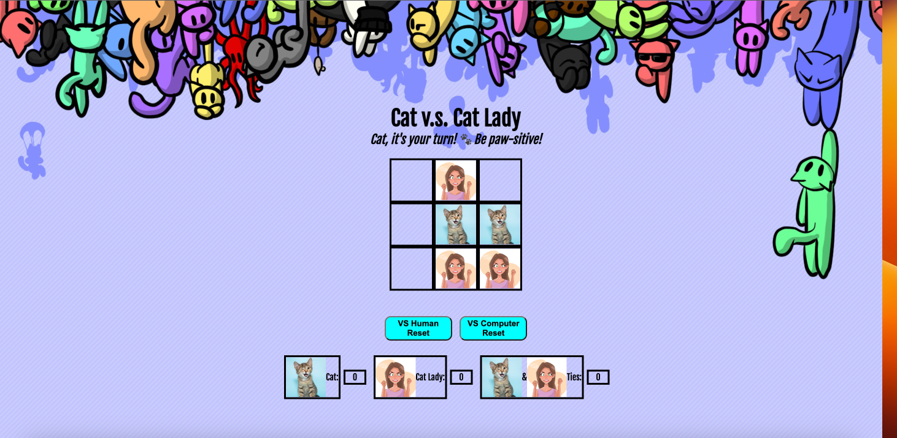

# Cat Vs Cat Lady

## [Play Cat Vs Cat Lady](https://catvscatlady.surge.sh/)

## 😻 Getting Started

Cat Vs Cat Lady is a game designed for frustrated cat owners who also happen to love tic-tac-toe. It provides a delightful twist on the classic game, allowing players to choose between playing as a cat or a cat lady. Engage in strategic battles and aim to claim victory!

## 😼 How to Play

1. **Play Against Computer or Human**: Play against a computer or a human.
2. **Choose Your Side**: Decide whether you want to play as the mischievous cat or the cunning cat lady.
3. **Select a Square**: Take turns with the other player to choose a square on the game board.
4. **Win the Game**: The player who successfully claims three squares in a row emerges as the winner and cat confetti falls down.
5. **Start a New Game**: Use the reset button to initiate a fresh game and continue the exciting competition.

##  ✍🏻 Attributions

* [MDN](https://developer.mozilla.org/en-US/)
* [W3Schools](https://www.w3schools.com/)

##  🖥️ Technologies Used

* HTML
* CSS
* JavaScript
* Git
* Adobe Photoshop

## 🧊 Ice Box
- [ ] Add light and dark mode.
- [ ] Add AI computer player.